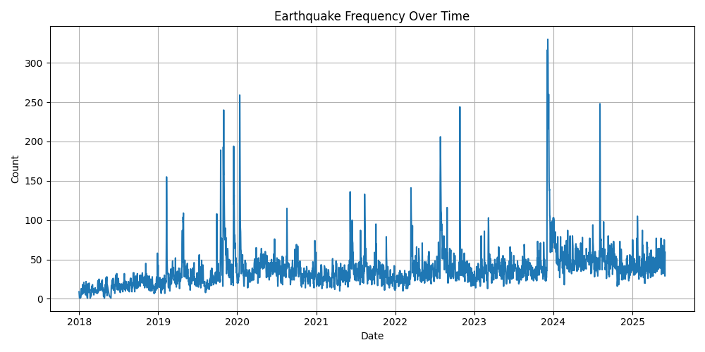
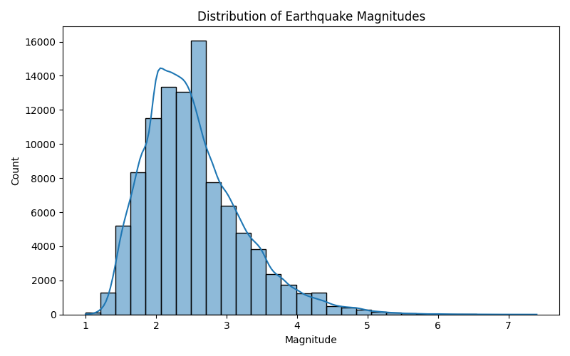
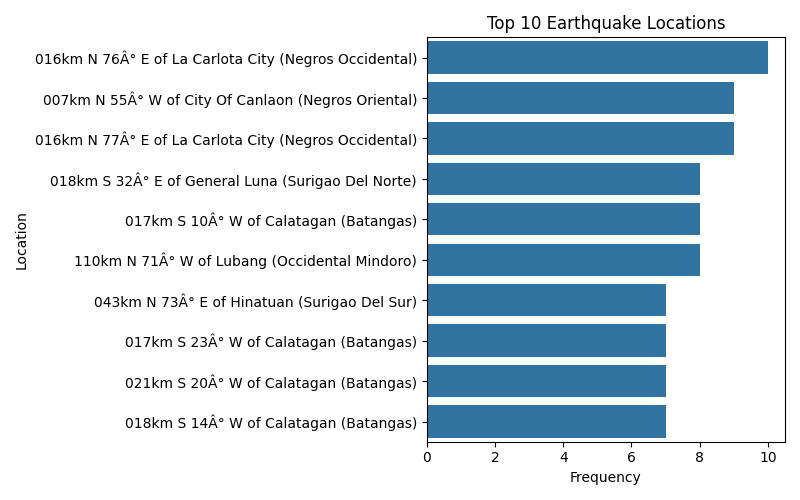

# Earthquake PH Report
**Generated on:** 2025-06-27 07:56:33

## Summary Statistics
```
                            Datetime   Latitude  Longitude      Depth  Magnitude
count                         100532  100532.00  100527.00  100529.00   99957.00
mean   2022-03-25 19:44:48.452632320      10.90     124.04      29.88       2.52
min              2018-01-01 00:04:00       1.78      12.68       0.00       1.00
25%              2020-06-08 02:57:00       7.86     121.24       9.00       2.00
50%              2022-06-19 03:19:30       9.87     124.97      21.00       2.40
75%              2023-12-31 03:32:15      13.84     126.28      33.00       2.90
max              2025-05-31 23:37:00      23.81     163.63     912.00       7.40
std                              NaN       4.06       2.57      38.15       0.70
```

## Earthquake Frequency Over Time


## Magnitude Distribution


## Top 10 Earthquake Locations

