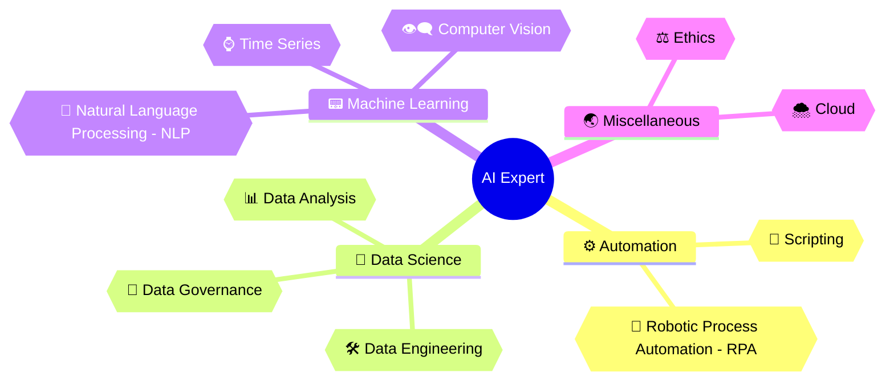

# Welcome to my GitHub Portfolio!
Here lies all of my learnings related to becoming an official Artificial Intelligence Expert.

# LEARNING DIVISIONS

## ⚙️ Automation

### 📜 Scripting
Helps to make sure to lessen repititive tasks and provide an easier workflow

### 🤖 Robotic Process Automation (RPA)
Uses tools to provide automation

## 🔬 Data Science

### 📊 Data Analysis
Without understanding data, it's hard to use them

### 🛠️ Data Engineering
Ensures that data will be properly transformed and stored

### 🪪 Data Governance
Data should have standards and policies for usage

## 📟 Machine Learning

### 👄 Natural Language Processing
Focuses on enabling machines to understand human language

### 👁️‍🗨️ Computer Vision
Deals with enabling computers to process images or videos

### ⌚️ Time Series
Involves analyzing data points based on time in order to detect trends or forecast values

## 🌏 Miscellaneous

### ⚖️ Ethics
Ensures to be literate in the field of Data and AI, and to know how to manage them properly.

### 🌨️ Cloud
Makes data and AI models available in public or running 24/7

# CONTENTS
This repo is divided into three parts:

## 🏅 Certification
Preparation, collection, and notes for all of the certifications that I'm trying and I've taken

### Exam

#### ABBYY
1. [ABBYY FlexiCapture 12 Specialist](https://github.com/Dixboi/AI-Expert/blob/main/Certification/ABBYY/ABBYY%20-%20ABBYY%20FlexiCapture%2012%20Specialist.pdf)

#### DataCamp
1. [AI Fundamentals](https://github.com/Dixboi/AI-Expert/blob/main/Certification/DataCamp/Career/DataCamp%20-%20AI%20Fundamentals.pdf)
2. [Data Engineer Associate](https://github.com/Dixboi/AI-Expert/blob/main/Certification/DataCamp/Career/DataCamp%20-%20Data%20Engineer%20Associate.pdf)
3. [Data Literacy](https://github.com/Dixboi/AI-Expert/blob/main/Certification/DataCamp/Career/DataCamp%20-%20Data%20Literacy.pdf)
4. [Data Scientist Associate](https://github.com/Dixboi/AI-Expert/blob/main/Certification/DataCamp/Career/DataCamp%20-%20Data%20Scientist%20Associate.pdf)

### Training

#### Blue Prism
1. [Blue Prism Foundation Training](https://github.com/Dixboi/AI-Expert/blob/main/Certification/Blue%20Prism/Blue%20Prism%20-%20Foundation%20Training.pdf)

#### Make
1. [Make Foundation Training and Assessment](https://github.com/Dixboi/AI-Expert/tree/main/Certification/Make), [Credly Link](https://www.credly.com/badges/24121d80-b777-44ab-8fdc-edcd915fdb50/public_url)

## 💪 Practical
Application of all my learnings like big or small projects

### Competition
1. [2023 Kaggle AI Report](https://github.com/Dixboi/AI-Expert/tree/main/Practical/Projects/2023%20Kaggle%20AI%20Report)

### Personal Projects
1. [Philippine Earthquakes](https://github.com/Dixboi/AI-Expert/tree/main/Practical/Projects/PH%20Earthquakes)

### 🧠 Theoretical
Collection of all the resources that help me to understand my target fields
